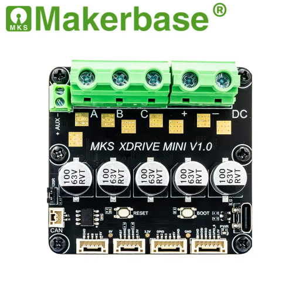

## Important Note
This repository is a fork/mod of the original ODrive firmware. It is not affiliated with the upstream ODrive project — do NOT contact the official ODrive project about changes in this fork.

This fork was adapted to run on certain MKS XDRIVE MINI boards and includes changes specific to that hardware.

## Overview

ODrive is a high-performance brushless motor controller firmware and tooling. This repository contains the firmware, Python tools (including `odrivetool`), documentation, and related utilities.

### Repository Structure
 - **Firmware**: ODrive firmware source and build rules
 - **tools**: Python tools and `odrivetool`
 - **docs**: Sphinx documentation and guides

CHANGES (high level):
- Removed axis1
- Bypassed OTP validation

TO DO:
- Add the possibility to build firmware for original ODrives from this fork
- Instead of bypassing the OTP, flash a valid OTP to the MKS

## Overview

ODrive is a high-performance brushless motor controller firmware and tooling. This repository contains the firmware, Python tools (including `odrivetool`), documentation, and related utilities.

Full documentation is maintained in the project wiki — please consult the wiki for setup, DFU flashing and build instructions:

https://github.com/brokenpotatoes/ODrive/wiki

